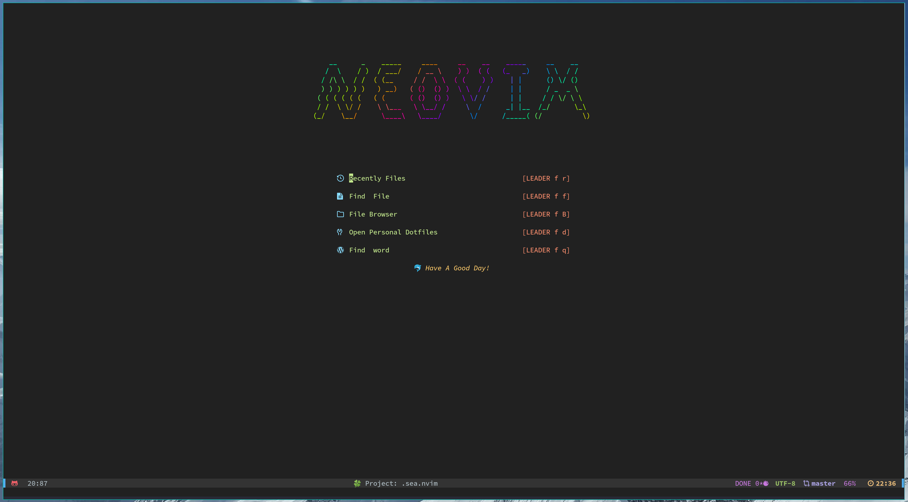
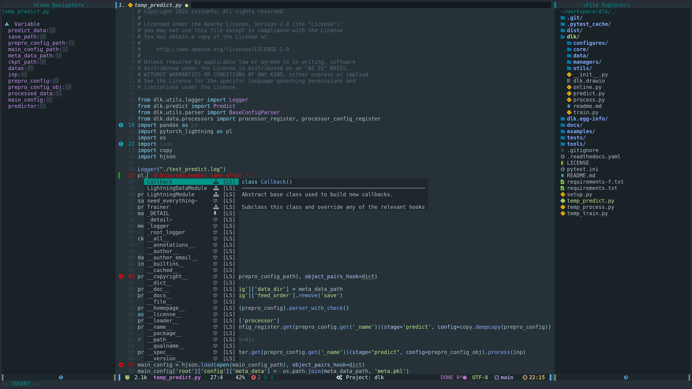
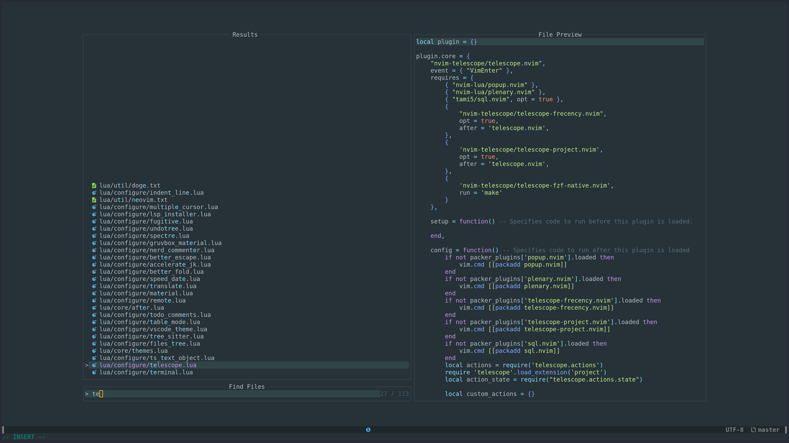
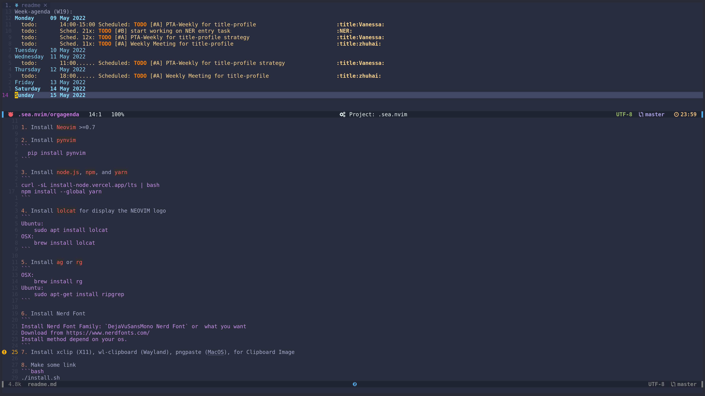
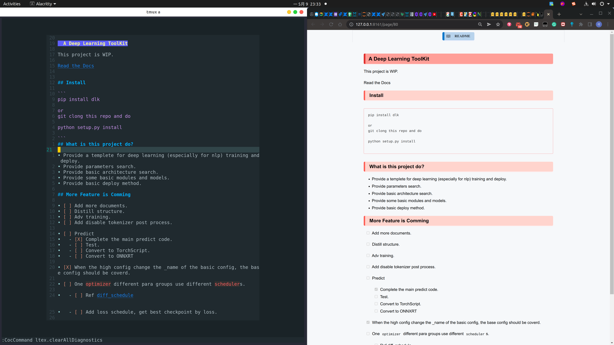
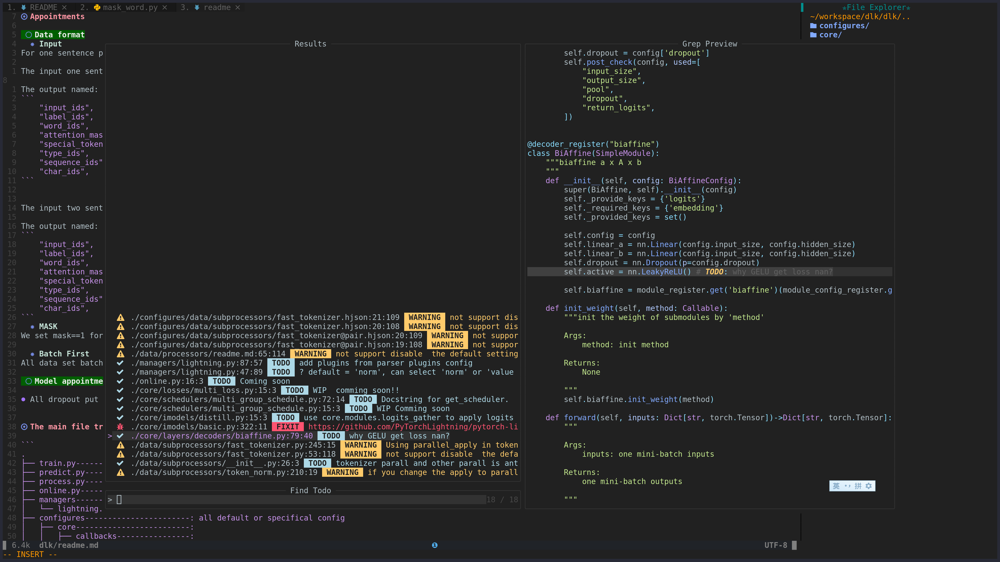
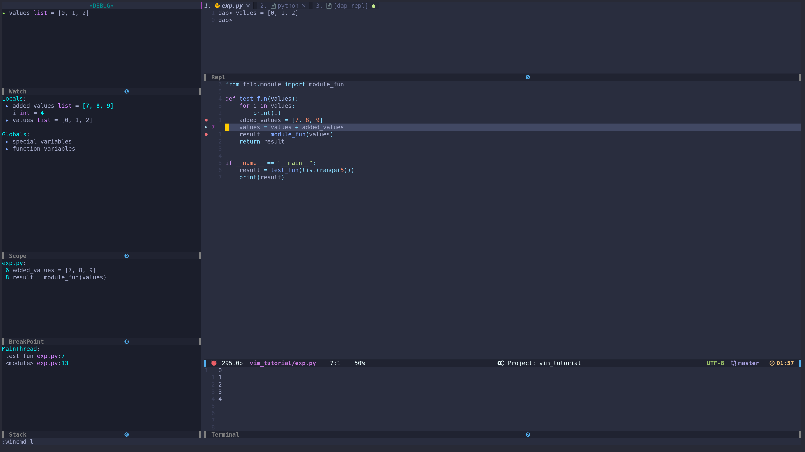
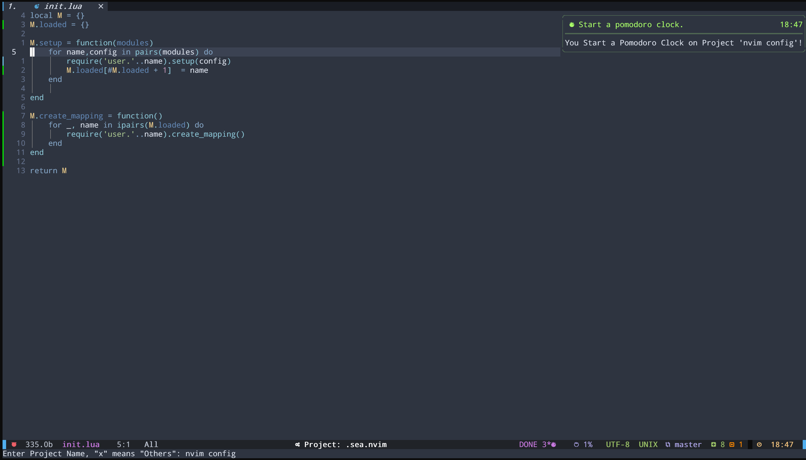

### Always Work In Process



# Neovim Configure


```
.
├── compiler                  -- compiler related setting
├── coc-settings.json         -- for coc.nvim if you use coc.nvim as default complation framework, you can also select the builtin lsp
├── ftplugin                  -- some specific setting for some filetype
├── init.lua
├── install.sh
├── lua
│   ├── configure            
│   │   ├── nvim_cmp.lua      -- builtin lsp complation config
│   │   ├── lsp_config        -- builtin lsp config
│   │   ├── ....              -- other plugin configs
│   │   └── coc.lua           -- coc.nvim based lsp config
│   ├── core
│   │   ├── after.lua         -- just eusure this will be setting after all plugin loaded
│   │   ├── default.lua       -- some default setting
│   │   ├── init.lua          -- 
│   │   ├── mapping.lua       -- mapping register module
│   │   ├── plugins.lua       -- all plugin name and group center
│   │   └── themes.lua        -- my favorite themes
│   ├── hack                  -- something you want to hack 
│   │   ├── init.lua
│   │   └── pomodoro.lua
│   ├── local.lua             -- 
│   ├── user.lua              -- user related configure like email, name, etc.
│   └── util                  -- some useful tools and functions
└── tasks.ini                 -- asynctasks

```

## Install

1. Install `Neovim` >=0.9, `git` >= 2.32

2. Install `pynvim` and `debugpy`(optional)
```
  # pynvim for python based plugins
  pip install pynvim
  # debugpy for python debug, just install it to your environment
  pip install debugpy
  # optional yapf for python format
  pip install yapf 
```

3. Install `node.js`, `npm`, and `yarn`
```
curl -sL install-node.vercel.app/lts | bash
-- for grammarly-language-server, it requires the [node@16](https://github.com/znck/grammarly/issues/334)
npm install --global yarn
```

4. Install `lolcat` for display the NEOVIM logo
```
Ubuntu:
    sudo apt install lolcat
OSX:
    brew install lolcat
```

5. Install `ag` or `rg`
```
OSX:
    brew install rg
Ubuntu:
    sudo apt-get install ripgrep
```

6. Install Nerd Font
```
Install Nerd Font Family: `DejaVuSansMono Nerd Font` or  what you want
Download from https://www.nerdfonts.com/
Install method depend on your os.
```
7. Install xclip (X11), wl-clipboard (Wayland), pngpaste (MacOS), for Clipboard Image

8. Make some link
```bash
./install.sh
```

9. User related setting in `lua/core/local.lua` and `lua/core/user.lua`.

Both `local.lua` and `user.lua` are bind to user. `user.lua` is more general for each user, and `local.lua` is special to each machine, and setting in `local.lua`  will not be indexed by git but `user.lua` will be.

My own setting example in `local.lua` is:
```
vim.g.global_proxy_port = 'http://127.0.0.1:7893' -- like "http://127.0.0.1:7893", this is for some plugin like google translate that is banned by GFW. if you don't have this issue, set it to `nil`
```
And some setting personally but put to `local.lua` like:

```
local themes = require('core.themes')
themes.setting(themes.configs.material_oceanic)

local user_setting = {
    python3_host_prog = vim.g.HOME_PATH .. '/miniconda3/bin/python3', -- add to your own python3 path
    snips_author = 'Sun Fu',
    snips_email = 'cstsunfu@gmail.com',
    snips_github = 'https://github.com/cstsunfu',
    snips_wechat = 'cstsunfu',
}

for key, value in pairs(user_setting) do
    vim.g[key] = value
end
```

NOTE: The default leader is setting in `lua/core/default.lua`. The setting is 
```
let maplocalleader=','
let mapleader=';'
nnoremap \\ ;
vnoremap \\ ;
```


10. Select `builtin` or `coc.nvim` for the default LSP in 'core/init.lua'.

For my experience,  `coc.nvim` is more easy to configure to get all things work. But now more and more neovim users change to use `builtin`?

11. Open neovim and run `:PackerSync<cr>` command to install Plugins by Packer plugin manager.


## Optional

1. Install `pg_format` for sql format

```
see https://github.com/darold/pgFormatter#:~:text=following%20your%20distribution.-,INSTALLATION,-Following%20your%20Linux
```

2. Install `sqlite3` for better frequence files display(<leader>fh)

```
sudo apt-get install sqlite3
sudo apt-get install libsqlite3-dev
```

## More

For getting the best performance, please use the GPU-based terminal:

* [kitty](https://github.com/kovidgoyal/kitty)
* [alacritty](https://github.com/jwilm/alacritty)

# Main features

Each figure may display with different colorscheme.

## Complete/Nvim-Tree/Navigator(based `builtin lsp`)


## Complete/Nvim-Tree/Navigator(based `coc.nvim`)


## Fuzzy Search


## Agenda


## Markdown & Vimwiki


## Project TODO


## Debug Adapter Protocol 


## Pomodoro Clock 



## There are some shortcuts.

    NOTE: Default set
    
    ```lua
        vim.cmd("let maplocalleader=' '")
        vim.cmd("let mapleader=';'")
        vim.cmd("nnoremap ' ;")
        vim.cmd("vnoremap ' ;")
    ```
       

    WARNING: We will remap some shortcuts but not update this table, just for reference.

| Mode    | Mapping            | Description                         |
| ------  | -------------      | ----------------------------        |
| x       | <                  | Left Indent Selected                |
| x       | >                  | Right Indent Selected               |
| i,c     | kj                 | Back to Normal Mode                 |
| n,i     | ;p                 | Paste From Clipboard                |
| n       | ;qA                | Directly Quit Without Save          |
| n       | ;qq                | Directly Quit                       |
| n       | ;qw                | Directly Quit After Write           |
| n       | ;qc                | QuickFix Close                      |
| n       | ;qo                | QuickFix Open                       |
| n       | ;qp                | QuickFix Previous Item              |
| n       | ;qn                | QuickFix Next Item                  |
| n       | ;rd                | Read Date From System               |
| n       | ;rr                | Reload Current File                 |
| n       | ;rt                | Read FileTree                       |
| n       | ;s.                | Source Current File                 |
| n       | ;s\<SPACE\>        | Remove Tail Space                   |
| n       | ;ss                | Save Current Buffer                 |
| n       | ;sa                | Save All Buffers                    |
| n       | ;ws                | Split Window                        |
| n       | ;wv                | Vertical Split Window               |
| n       | ;wd                | Close Current Window                |
| n       | ;wo                | Only Reserve Current Window         |
| n       | ;ww                | Goto Next Window                    |
| n       | ;wj                | Goto The Down Window                |
| n       | ;wk                | Goto The Above Window               |
| n       | ;wh                | Goto The Left Window                |
| n       | ;wl                | Goto The Right Window               |
| n       | ;wJ                | Goto The Bottom Window              |
| n       | ;wK                | Goto The Top Window                 |
| n       | ;wH                | Goto The Leftest Window             |
| n       | ;wL                | Goto The Rightest Window            |
| n       | ;x                 | Close Current Window                |
| v       | ;y                 | Yank to Clipboard                   |
| n       | ;\<TAB\>           | Smart toggle fold                   |
| n       | zR                 | Unzip all                           |
| n       | zr                 | Unzip                               |
| n       | za                 | Zip toggle                          |
| n       | zm                 | Zip current                         |
| n       | zM                 | Zip all                             |
| n       | zo                 | Unzip current                       |
| n       | \<A-L\>            | <alt-l>Goto Right Window            |
| n       | \<A-K\>            | <alt-k>Goto Above Window            |
| n       | \<A-H\>            | <alt-h>Goto Left Window             |
| n       | \<A-J\>            | <alt-j>Goto Below Window            |
| n       | \<A-F\>            | <alt-f>Go to Next Buffer            |
| n       | \<A-B\>            | <alt-b>Go to Previous Buffer        |
| n       | \<A-W\>            | <alt-w>Size +5                      |
| n       | \<A-S\>            | <alt-s>Size -5                      |
| n       | \<A-A\>            | <alt-a>Vertical Size -5             |
| n       | \<A-D\>            | <alt-d>Vertical Size +5             |
| n,v     | \<C-J\>            | 5j                                  |
| n,v     | \<C-k\>            | 5k                                  |
| n       | \<SPACE\>\<CR\>    | No Search Highlight                 |
| i       | \<C-U\>            | Delete Prior Word                   |
| i       | \<C-H\>            | Delete Prior Char                   |
| i       | \<C-D\>            | Delete Next Char                    |
| i       | \<C-K\>            | Delete To The End                   |
| i       | \<C-J\>            | Delete To The Begin                 |
| i       | \<C-B\>            | Go Left                             |
| i       | \<C-F\>            | Go Right                            |
| i       | \<C-A\>            | Go To The Begin and Insert          |
| i       | \<C-E\>            | Go To The End and Append            |
| i       | \<C-O\>            | New Line and Insert                 |
| i       | \<C-S\>            | Save                                |
| i       | \<C-Q\>            | Save & Quit                         |
| n       | \<C-Q\>            | Save & Quit                         |
| v       | gx                 | Open URL Link                       |
| n       | gx                 | Open URL Link                       |
| n       | ;ga                | Git Add                             |
| n       | ;gb                | Git Blame                           |
| n       | ;gc                | Git Commits                         |
| n       | ;gC                | Git Checkout                        |
| n       | ;ge                | Git Edit Something                  |
| n       | ;gd                | Git Diff                            |
| n       | ;gg                | Git Grep                            |
| n       | ;gl                | Git Log For Current File            |
| n       | ;gL                | Git Log                             |
| n       | ;gm                | Git Move                            |
| n       | ;gr                | Git Read                            |
| n       | ;gs                | Git Status                          |
| n       | ;gw                | Git Write                           |
| n       | ;gu                | Git Pull                            |
| n       | ;gp                | Git Push                            |
| n       | ;gi                | Git Indicator Toggle                |
| n       | \<SPACE\>\<SPACE\> | Blink Cursor                        |
| n       | \<SPACE\>1         | Goto 1 Window                       |
| n       | \<SPACE\>2         | Goto 2 Window                       |
| n       | \<SPACE\>3         | Goto 3 Window                       |
| n       | \<SPACE\>4         | Goto 4 Window                       |
| n       | \<SPACE\>5         | Goto 5 Window                       |
| n       | \<SPACE\>6         | Goto 6 Window                       |
| n       | \<SPACE\>7         | Goto 7 Window                       |
| n       | \<SPACE\>8         | Goto 8 Window                       |
| n       | \<SPACE\>9         | Goto 9 Window                       |
| n       | ;1                 | Goto 1 Buffer                       |
| n       | ;2                 | Goto 2 Buffer                       |
| n       | ;3                 | Goto 3 Buffer                       |
| n       | ;4                 | Goto 4 Buffer                       |
| n       | ;5                 | Goto 5 Buffer                       |
| n       | ;6                 | Goto 6 Buffer                       |
| n       | ;7                 | Goto 7 Buffer                       |
| n       | ;8                 | Goto 8 Buffer                       |
| n       | ;9                 | Goto 9 Buffer                       |
| n       | ;A                 | Goto A Buffer                       |
| n       | ;B                 | Goto B Buffer                       |
| n       | ;C                 | Goto C Buffer                       |
| n       | ;D                 | Goto D Buffer                       |
| n       | ;E                 | Goto E Buffer                       |
| n       | ;F                 | Goto F Buffer                       |
| n       | ;G                 | Goto G Buffer                       |
| n       | ;H                 | Goto H Buffer                       |
| n       | ;I                 | Goto I Buffer                       |
| n       | ;J                 | Goto J Buffer                       |
| n       | ;K                 | Goto K Buffer                       |
| n       | ;L                 | Goto L Buffer                       |
| n       | ;M                 | Goto M Buffer                       |
| n       | ;N                 | Goto N Buffer                       |
| n       | ;bn                | Goto Next Buffer                    |
| n       | ;bp                | Goto Prev Buffer                    |
| n       | ;bf                | Goto First Buffer                   |
| n       | ;bl                | Goto Last Buffer                    |
| n       | ;bd                | Delete Current Buffer               |
| n       | ;bD                | Delete All Buffer Except Current    |
| n       | ;bR                | Delete All Right Buffers            |
| n       | ;bL                | Delete All Left Buffers             |
| n       | ;bs                | Buffer Sorted By Whether Modified   |
| n       | ;tc                | Tab Create                          |
| n       | ;tx                | Tab Close                           |
| n       | ;tn                | Tab Next                            |
| n       | ;tp                | Tab Previous                        |
| n       | ;f;s               | Open Startify Page                  |
| n       | ;tl                | Tag List                            |
| n       | ;sr                | Search By Reg Exp.                  |
| n       | ;sf                | Search Current Word                 |
| n       | ;ff                | Find files                          |
| n       | ;fB                | File Browser                        |
| n       | ;fR                | Find Recent Context                 |
| n       | ;fr                | Find Recent/History                 |
| n       | ;fq                | Find Query                          |
| n       | ;fl                | Find Lines                          |
| n       | ;fb                | Find Buffers                        |
| n       | ;fc                | Find Command History                |
| n       | ;fd                | Open Dotfiles                       |
| n       | ;fw                | Find Wiki                           |
| n       | ;fj                | Find Wiki                           |
| n       | ;fh                | Find Recent/History                 |
| n       | ;fp                | Find Project                        |
| n       | ;sp                | Save Project                        |
| n       | ;fm                | Find All Mappings                   |
| n       | ;f;                | Find More                           |
| n       | ;f;r               | Find Registers                      |
| n       | ;f;h               | Find Highlights                     |
| n       | ;f;t               | Find Themes                         |
| n       | ;f;p               | Find Planets                        |
| n       | ;f;g               | Find Git Commits                    |
| n       | ;f;G               | Find Git Commits(buffer)            |
| n       | ;f;j               | Find Jump List                      |
| n       | ;f;m               | Find Marks                          |
| n       | ;dq                | Debug Quit     F2                   |
| n       | ;dC                | Clear Breaks   F4                   |
| n       | ;dc                | Run Continue   F5                   |
| n       | ;dB                | Step Back      F6                   |
| n       | ;da                | Advanced Debug                      |
| n       | ;daw               | Advanced Break F7                   |
| n       | ;dac               | Cond Break     F8                   |
| n       | ;db                | Toggle Break   F9                   |
| n       | ;do                | Step Over      F10                  |
| n       | ;di                | Step Into      F11                  |
| n       | ;dO                | Step Out       F12                  |
| n       | ;dr                | Repl Open                           |
| n       | ;mt                | Quick Build                         |
| n       | ;ce                | Code Edit(markdown)                 |
| n       | ;mp                | Markdown Preview                    |
| n       | \<SPACE\>f         | Display Formula                     |
| n       | \<SPACE\>p         | Paste Image                         |
| n       | ;tm                | Toggle Table Mode                   |
| n       | ;tfe               | Table Fomule Eval                   |
| n       | ;oa                | Org Agenda                          |
| n       | ;oc                | Org Capture                         |
| n       | ;ox                | Org Clock                           |
| n       | ;oxe               | Org Effort Estimate                 |
| n       | ;oxi               | Clock In                            |
| n       | ;oxo               | Clock Out                           |
| n       | ;oxq               | Clock Cancel                        |
| n       | ;oxj               | Clock Goto                          |
| n       | cir                | Org Priority Down                   |
| n       | ciR                | Org Priority Up                     |
| x       | ciR                | Org Priority Up                     |
| n       | cit                | Org Todo Status                     |
| n       | ciT                | Org Todo Status                     |
| n       | cid                | Org Change Date                     |
| n       | ;of                | Org Open File                       |
| n       | ;ot                | Org Tag                             |
| n       | ;oi                | Org Insert                          |
| n       | ;oid               | Org Insert DEADLINE                 |
| n       | ;oih               | Org Insert Headline                 |
| n       | ;ois               | Org Insert SCHEDULED                |
| n       | ;oit               | Org Insert TODO                     |
| n       | ;oi.               | Org Insert Time Stamp               |
| n       | ;oiT               | Org Inplace Insert TODO             |
| n       | ;oi,               | Org Insert Inactive Time Stamp      |
| n       | ;oK                | Org Move Up                         |
| n       | ;oJ                | Org Move Down                       |
| n       | ;o'                | Org Edit Source                     |
| n       | ;o$                | Org Archive Subtree                 |
| n       | ;oA                | Org Archive Tag                     |
| n       | ;or                | Org Refile To                       |
| n       | ;o*                | Org Toggle Headline                 |
| n       | ;o,                | Org Priority                        |
| n       | ;oe                | Org Export(Emacs)                   |
| n       | ;oC                | Calendar                            |
| n       | ;O                 | Vimwiki                             |
| n       | ;o;                | Vimwiki Make Note                   |
| n       | ;fo                | ObsidianSearch                      |
| n       | ;on                | New Draft Obsidian                  |
| n       | ;tt                | Toggle TODO List                    |
| n       | ;tw                | Translate Current Word.             |
| v       | ;tw                | Translate Current Vision Word.      |
| n,v     | \<CR\>             | Auto Select Span                    |
| n       | ;jr                | Jupyter Run                         |
| n       | ;j.                | Jupyter Change Dir to Current       |
| n       | ;jc                | Jupyter Connect                     |
| n       | \<SPACE\>je        | Jupyter Run Visual                  |
| v       | \<SPACE\>e         | Jupyter Run Visual                  |
| n       | ;np                | Jupyter Convert                     |
| t       | \<ESC\>            | Back to Normal Mode                 |
| t       | kj                 | Back to Normal Mode                 |
| v,x     | \<C-S\>            | Send Select Text to First Termianl  |
| n       | \<C-S\>            | Send Current Line to First Termianl |
| n       | ;ti                | Terminal IPython                    |
| n       | ;re                | Remote Edit                         |
| n       | ;rc                | Remote Configure                    |
| n       | ;cn                | Color New                           |
| n       | ;cp                | Color Picker                        |
| n       | ;cs                | Color Select(CSS)                   |
| n       | ;cg                | Color Gradient 2 Colors             |
| n       | ;ft                | File Tree                           |
| n       | ;f.                | Current File Tree                   |
| n       | ;to                | Toggle Only Window(ZenMode)         |
| n       | ;sk                | Session Keep                        |
| n       | ;sL                | Session List                        |
| n       | ;sd                | Session Delete                      |
| n       | ;sl                | Load Session(Dir)                   |
| n       | ;lc                | Lsp Config                          |
| n       | gd                 | Goto Definition                     |
| n       | gr                 | Goto References                     |
| n       | gi                 | Goto Implementation                 |
| n       | ;sn                | Prev Diagnostic                     |
| n       | ]e                 | Next Diagnostic                     |
| n       | [e                 | Prev Diagnostic                     |
