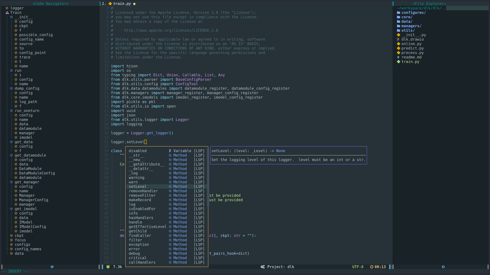

### Always Work In Process


# Neovim Configure


```
.
├── compiler                  -- compiler related setting
├── coc-settings.json         -- for coc.nvim if you use coc.nvim as default complation framework, you can also select the builtin lsp
├── ftplugin                  -- some specific setting for some filetype
├── init.lua
├── install.sh
├── lua
│   ├── configure            
│   │   ├── nvim_cmp.lua      -- builtin lsp complation config
│   │   ├── lsp_config        -- builtin lsp config
│   │   ├── ....              -- other plugin configs
│   │   └── coc.lua           -- coc.nvim based lsp config
│   ├── core
│   │   ├── after.lua         -- just eusure this will be setting after all plugin loaded
│   │   ├── default.lua       -- some default setting
│   │   ├── init.lua          -- 
│   │   ├── mapping.lua       -- mapping register module
│   │   ├── plugins.lua       -- all plugin name and group center
│   │   └── themes.lua        -- my favorite themes
│   ├── hack                  -- something you want to hack 
│   │   ├── init.lua
│   │   └── pomodoro.lua
│   ├── local.lua             -- 
│   ├── user.lua              -- user related configure like email, name, etc.
│   └── util                  -- some useful tools and functions
└── tasks.ini                 -- asynctasks

```

## Install

1. Install `Neovim` >=0.9, `git` >= 2.32

2. Install `pynvim` and `debugpy`(optional)
```
  # pynvim for python based plugins
  pip install pynvim
  # debugpy for python debug, just install it to your environment
  pip install debugpy
```

3. Install `node.js`, `npm`, and `yarn`
```
curl -sL install-node.vercel.app/lts | bash
npm install --global yarn
```

4. Install `lolcat` for display the NEOVIM logo
```
Ubuntu:
    sudo apt install lolcat
OSX:
    brew install lolcat
```

5. Install `ag` or `rg`
```
OSX:
    brew install rg
Ubuntu:
    sudo apt-get install ripgrep
```

6. Install Nerd Font
```
Install Nerd Font Family: `DejaVuSansMono Nerd Font` or  what you want
Download from https://www.nerdfonts.com/
Install method depend on your os.
```
7. Install xclip (X11), wl-clipboard (Wayland), pngpaste (MacOS), for Clipboard Image

8. Make some link
```bash
./install.sh
```

9. User related setting in `lua/core/local.lua` and `lua/core/user.lua`.

Both `local.lua` and `user.lua` are bind to user. `user.lua` is more general for each user, and `local.lua` is special to each machine, and setting in `local.lua`  will not be indexed by git but `user.lua` will be.

My own setting example in `local.lua` is:
```
vim.g.global_proxy_port = 'http://127.0.0.1:7893' -- like "http://127.0.0.1:7893", this is for some plugin like google translate that is banned by GFW. if you don't have this issue, set it to `nil`
```
And some setting personally but put to `local.lua` like:

```
local themes = require('core.themes')
themes.setting(themes.configs.material_oceanic)

local user_setting = {
    python3_host_prog = vim.g.HOME_PATH .. '/miniconda3/bin/python3', -- add to your own python3 path
    snips_author = 'Sun Fu',
    snips_email = 'cstsunfu@gmail.com',
    snips_github = 'https://github.com/cstsunfu',
    snips_wechat = 'cstsunfu',
}

for key, value in pairs(user_setting) do
    vim.g[key] = value
end
```

NOTE: The default leader is setting in `lua/core/default.lua`. The setting is 
```
let maplocalleader=','
let mapleader=';'
nnoremap \\ ;
vnoremap \\ ;
```


10. Select `builtin` or `coc.nvim` for the default LSP in 'core/init.lua'.

For my experience,  `coc.nvim` is more easy to configure to get all things work. But now more and more neovim users change to use `builtin`?

11. Open neovim and run `:PackerSync<cr>` command to install Plugins by Packer plugin manager.


## Optional

1. Install `sql-formatter` for sql format

```
npm install sql-formatter
```

2. Install `sqlite3` for better frequence files display(<leader>fh)

```
sudo apt-get install sqlite3
sudo apt-get install libsqlite3-dev
```

## More

For getting the best performance, please use the GPU-based terminal:

* [kitty](https://github.com/kovidgoyal/kitty)
* [alacritty](https://github.com/jwilm/alacritty)

# Main features

Each figure may display with different colorscheme.

## Complete/Nvim-Tree/Navigator(based `builtin lsp`)


## Complete/Nvim-Tree/Navigator(based `coc.nvim`)


## Fuzzy Search


## Agenda


## Markdown & Vimwiki


## Project TODO


## Debug Adapter Protocol 


## Pomodoro Clock 


## There are some shortcuts.

    NOTE: Default set
    
    ```lua
        vim.cmd("let maplocalleader=' '")
        vim.cmd("let mapleader=';'")
        vim.cmd("nnoremap ' ;")
        vim.cmd("vnoremap ' ;")
    ```
       

    WARNING: We will remap some shortcuts but not update this table, just for reference.


| Mode | Mapping        | Description                         |
|------|----------------|-------------------------------------|
| n    | ;cA            | Comment Append                      |
| v    | ;cA            | Comment Append                      |
| n    | ;cu            | UnComment                           |
| v    | ;cu            | UnComment                           |
| n    | ;gv            | Git Diff View                       |
| n    | ;gh            | Git History                         |
| n    | ;se            | Test ot                             |
| v    | ;ld            | Line Diff                           |
| n    | ;ht            | History Tree                        |
| n    | ;dq            | Debug Quit     F2                   |
| n    | ;dC            | Clear Breaks   F4                   |
| n    | ;dc            | Run Continue   F5                   |
| n    | ;dB            | Step Back      F6                   |
| n    | ;da            | Advanced Debug                      |
| n    | ;daw           | Advanced Break F7                   |
| n    | ;dac           | Cond Break     F8                   |
| n    | ;db            | Toggle Break   F9                   |
| n    | ;do            | Step Over      F10                  |
| n    | ;di            | Step Into      F11                  |
| n    | ;dO            | Step Out       F12                  |
| n    | ;dr            | Repl Open                           |
| n    | ;mp            | Markdown Preview                    |
| n    | \<SPACE\>f              | Display Formula                     |
| n    | \<SPACE\>p              | Paste Image                         |
| n    | ;tm            | Toggle Table Mode                   |
| n    | ;tfe           | Table Fomule Eval                   |
| n    | ;oC            | Calendar                            |
| n    | ;oa            | Org Agenda                          |
| n    | ;oc            | Org Capture                         |
| n    | ;ox            | Org Clock                           |
| n    | ;oxe           | Org Effort Estimate                 |
| n    | ;oxi           | Clock In                            |
| n    | ;oxo           | Clock Out                           |
| n    | ;oxq           | Clock Cancel                        |
| n    | ;oxj           | Clock Goto                          |
| n    | cir            | Org Priority Down                   |
| n    | ciR            | Org Priority Up                     |
| x    | ciR            | Org Priority Up                     |
| n    | cit            | Org Todo Status                     |
| n    | ciT            | Org Todo Status                     |
| n    | cid            | Org Change Date                     |
| n    | ;of            | Org Open File                       |
| n    | ;ot            | Org Tag                             |
| n    | ;oi            | Org Insert                          |
| n    | ;oid           | Org Insert DEADLINE                 |
| n    | ;oih           | Org Insert Headline                 |
| n    | ;ois           | Org Insert SCHEDULED                |
| n    | ;oit           | Org Insert TODO                     |
| n    | ;oi.           | Org Insert Time Stamp               |
| n    | ;oiT           | Org Inplace Insert TODO             |
| n    | ;oi,           | Org Insert Inactive Time Stamp      |
| n    | ;oK            | Org Move Up                         |
| n    | ;oJ            | Org Move Down                       |
| n    | ;o'            | Org Edit Source                     |
| n    | ;o$            | Org Archive Subtree                 |
| n    | ;oA            | Org Archive Tag                     |
| n    | ;or            | Org Refile To                       |
| n    | ;o*            | Org Toggle Headline                 |
| n    | ;o,            | Org Priority                        |
| n    | ;oe            | Org Export(Emacs)                   |
| n    | ;O             | Vimwiki                             |
| n    | ;o;            | Vimwiki Make Note                   |
| n    | ;fo            | ObsidianSearch                      |
| n    | ;on            | New Draft Obsidian                  |
| n    | ;mt            | Quick Build                         |
| n    | ;ce            | Code Edit(markdown)                 |
| n    | ;to            | Toggle Only Window(ZenMode)         |
| n    | ;tw            | Translate Current Word.             |
| v    | ;tw            | Translate Current Vision Word.      |
| n    | \<cr\>           | Auto Select Span                    |
| v    | \<cr\>           | Auto Select Span                    |
| v    | \<C-S\>          | Auto Select Span Previous           |
| n    | ;jr            | Jupyter Run                         |
| n    | ;j.            | Jupyter Change Dir to Current       |
| n    | ;jc            | Jupyter Connect                     |
| n    | \<SPACE\>je             | Jupyter Run Visual                  |
| v    | \<SPACE\>e              | Jupyter Run Visual                  |
| n    | ;np            | Jupyter Convert                     |
| t    | <esc>          | Back to Normal Mode                 |
| t    | kj             | Back to Normal Mode                 |
| v    | \<C-s\>        | Send Select Text to First Termianl  |
| x    | \<C-s\>        | Send Select Text to First Termianl  |
| n    | \<C-s\>        | Send Current Line to First Termianl |
| n    | ;ti            | Terminal IPython                    |
| n    | ;cn            | Color New                           |
| n    | ;cp            | Color Picker                        |
| n    | ;cs            | Color Select(CSS)                   |
| n    | ;cg            | Color Gradient 2 Colors             |
| n    | ;ft            | File Tree                           |
| n    | ;f.            | Current File Tree                   |
| n    | ;re            | Remote Edit                         |
| n    | ;rc            | Remote Configure                    |
| n    | ;sk            | Session Keep                        |
| n    | ;sL            | Session List                        |
| n    | ;sd            | Session Delete                      |
| n    | ;sl            | Load Session(Dir)                   |
| n    | ;tt            | Toggle TODO List                    |
| n    | gT             | Goto Trouble Reference              |
| n    | ;lt            | Trouble Toggle                      |
| n    | ;lq            | Trouble Quickfix                    |
| n    | ;lw            | Trouble Workspace                   |
| n    | ;ll            | Trouble Loclist                     |
| n    | ;ld            | Trouble Document                    |
| n    | gG             | Glance Definitions                  |
| n    | gf             | Lsp Finder                          |
| n    | ga             | Lsp Code Action                     |
| n    | gp             | Lsp Peek Definition                 |
| n    | gR             | Lsp Rename                          |
| n    | K              | Displays Hover                      |
| n    | ;lc            | Lsp Config                          |
| n    | gd             | Goto Definition                     |
| n    | gr             | Goto References                     |
| n    | gi             | Goto Implementation                 |
| n    | ;sn            | Prev Diagnostic                     |
| n    | ]e             | Next Diagnostic                     |
| n    | [e             | Prev Diagnostic                     |
| n    | \<C-p\>          | Next Diagnostic                     |
| n    | ;=             | Code Format                         |
| n    | ;s=            | Sql Format                          |
| v    | ;s=            | Sql Format                          |
| n    | ;gi            | Git Indicator Toggle                |
| n    | ;ga            | Git Add                             |
| n    | ;gb            | Git Blame                           |
| n    | ;gc            | Git Commits                         |
| n    | ;gC            | Git Checkout                        |
| n    | ;ge            | Git Edit Something                  |
| n    | ;gd            | Git Diff                            |
| n    | ;gg            | Git Grep                            |
| n    | ;gl            | Git Log For Current File            |
| n    | ;gL            | Git Log                             |
| n    | ;gm            | Git Move                            |
| n    | ;gr            | Git Read                            |
| n    | ;gs            | Git Status                          |
| n    | ;gw            | Git Write                           |
| n    | ;gu            | Git Pull                            |
| n    | ;gp            | Git Push                            |
| n    | ;f;s           | Open Startify Page                  |
| n    | \<SPACE\>1              | Goto 1 Window                       |
| n    | \<SPACE\>2              | Goto 2 Window                       |
| n    | \<SPACE\>3              | Goto 3 Window                       |
| n    | \<SPACE\>4              | Goto 4 Window                       |
| n    | \<SPACE\>5              | Goto 5 Window                       |
| n    | \<SPACE\>6              | Goto 6 Window                       |
| n    | \<SPACE\>7              | Goto 7 Window                       |
| n    | \<SPACE\>8              | Goto 8 Window                       |
| n    | \<SPACE\>9              | Goto 9 Window                       |
| n    | ;1             | Goto 1 Buffer                       |
| n    | ;2             | Goto 2 Buffer                       |
| n    | ;3             | Goto 3 Buffer                       |
| n    | ;4             | Goto 4 Buffer                       |
| n    | ;5             | Goto 5 Buffer                       |
| n    | ;6             | Goto 6 Buffer                       |
| n    | ;7             | Goto 7 Buffer                       |
| n    | ;8             | Goto 8 Buffer                       |
| n    | ;9             | Goto 9 Buffer                       |
| n    | ;A             | Goto A Buffer                       |
| n    | ;B             | Goto B Buffer                       |
| n    | ;C             | Goto C Buffer                       |
| n    | ;D             | Goto D Buffer                       |
| n    | ;E             | Goto E Buffer                       |
| n    | ;F             | Goto F Buffer                       |
| n    | ;G             | Goto G Buffer                       |
| n    | ;H             | Goto H Buffer                       |
| n    | ;I             | Goto I Buffer                       |
| n    | ;J             | Goto J Buffer                       |
| n    | ;K             | Goto K Buffer                       |
| n    | ;L             | Goto L Buffer                       |
| n    | ;M             | Goto M Buffer                       |
| n    | ;N             | Goto N Buffer                       |
| n    | ;bn            | Goto Next Buffer                    |
| n    | ;bp            | Goto Prev Buffer                    |
| n    | ;bf            | Goto First Buffer                   |
| n    | ;bl            | Goto Last Buffer                    |
| n    | ;bd            | Delete Current Buffer               |
| n    | ;bD            | Delete All Buffer Except Current    |
| n    | ;bR            | Delete All Right Buffers            |
| n    | ;bL            | Delete All Left Buffers             |
| n    | ;bs            | Buffer Sorted By Whether Modified   |
| n    | ;tc            | Tab Create                          |
| n    | ;tx            | Tab Close                           |
| n    | ;tn            | Tab Next                            |
| n    | ;tp            | Tab Previous                        |
| n    | \<SPACE\>\<SPACE\> | Blink Cursor                        |
| n    | ;op            | Pomodoro Clock                      |
| n    | ;ops           | Start Pomodoro Clock                |
| n    | ;opq           | Quit Pomodoro Clock                 |
| n    | ;opc           | Cancel Pomodoro Clock               |
| n    | ;c<tab> | ColorStyle Exchange                 ||
