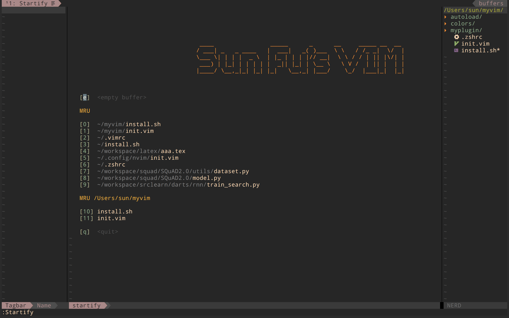

# MacOS上的vim
## Dependent
* neovim
* python3, python2
* 最好用oh-my-zsh

## Install

    ./install.sh
    打开nvim执行:
    :PlugInstall

更多展示在 [展示](https://cstsunfu.github.io/2017/11/myvim/)

## Shortcut

(几乎)所有快捷键定义在myplugin/configure/myshortcut.vim 中
