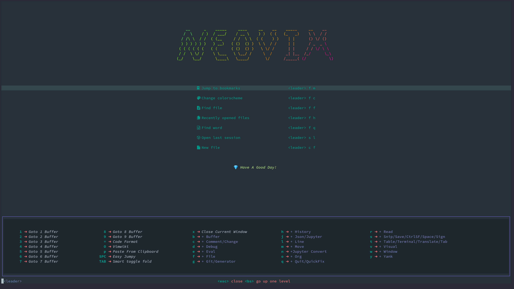
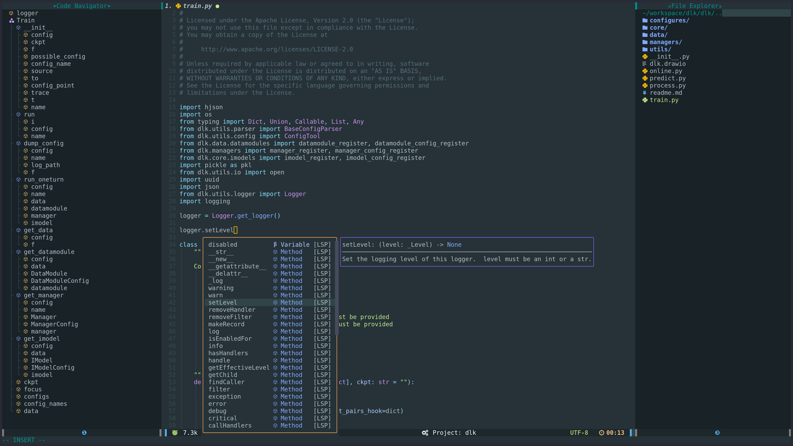

# Neovim Configure

## Install

1. Install `Neovim` >=0.7

2. Install `pynvim`
```
  pip install pynvim
```

3. Install `node.js`, `npm`, and `yarn`
```
curl -sL install-node.vercel.app/lts | bash
npm install --global yarn
```

4. Install `lolcat` for display the NEOVIM logo
```
Ubuntu:
    sudo apt install lolcat
OSX:
    brew install lolcat
```

5. Install `ag` or `rg`
```
OSX:
    brew install rg
Ubuntu:
    sudo apt-get install ripgrep
```

6. Install Nerd Font
```
Install Nerd Font Family: `DejaVuSansMono Nerd Font` or  what you want
Download from https://www.nerdfonts.com/
Install method depend on your os.
```
7. Install xclip (X11), wl-clipboard (Wayland), pngpaste (MacOS), for Clipboard Image

8. Make some link
```bash
./install.sh
```

9. User related setting in `lua/core/local.lua` and `lua/core/user.lua`.

Both `local.lua` and `user.lua` are bind to user. `user.lua` is more general for each user,  and `local.lua` is special to each machine, and setting in `local.lua`  will not be indexed by git but `user.lua` will be.

My own setting example in `local.lua` is:
```
vim.g.global_proxy_port = 'http://127.0.1.1:7893' -- like "http://127.0.0.1:7893", this is for some plugin like google translate that is banned by GFW. if you don't have this issue, set it to `nil`
```
And some setting personally but put to `local.lua` like:

```
local themes = require('core.themes')
themes.setting(themes.configs.material_oceanic)

local user_setting = {
    python3_host_prog = vim.g.HOME_PATH .. '/anaconda3/bin/python3', -- add to your own python3 path
    snips_author = 'Sun Fu',
    snips_email = 'cstsunfu@gmail.com',
    snips_github = 'https://github.com/cstsunfu',
    snips_wechat = 'cstsunfu',
}

for key, value in pairs(user_setting) do
    vim.g[key] = value
end
```

NOTE: The default leader is setting in `lua/core/default.lua`. The setting is 
```
let maplocalleader=','
let mapleader=';'
nnoremap \\ ;
vnoremap \\ ;
```

10. Select `buildin` or `coc.nvim` for the default LSP in 'core/init.lua'.

In my opnion, `coc.nvim` is more easy to use in the most of the time. But now more and more neovim users change to use `buildin`?

11. Open neovim and run `:PackerSync<cr>` command to install Plugins by Packer plugin manager.


## More

For getting the best performance, please use the GPU-based terminal:

* [kitty](https://github.com/kovidgoyal/kitty)
* [alacritty](https://github.com/jwilm/alacritty)

# Main features

Each figure may be displaied with different colorscheme.

## Complete/Nvim-Tree/Navigator(based `buildin lsp`)


## Complete/Nvim-Tree/Navigator(based `coc.nvim`)


## Fuzzy Search


## Agenda


## Markdown & Vimwiki


## Project TODO


## Debug Adapter Protocol 


## Pomodoro Clock 


TODO: More detail


```
.
├── coc-settings.json         -- coc lsp 设置，也可选内置LSP
├── compiler                  -- 编译相关配置
│   └── python.vim
├── ftplugin                  -- 和原来的vim script一样，根据文件类型加载模块                  
│   ├── lua.lua               
│   ├── python.lua            --                         
│   └── vimwiki.vim           --                          
├── init.lua                  -- neovim配置文件入口                  
├── init.lua
├── install.sh
├── lua
│   ├── configure
│   ├── core                  -- 核心模块                 
│   │   ├── after.lua         -- 后处理模块                    
│   │   ├── default.lua       -- 默认设置模块                             
│   │   ├── init.lua          -- 核心加载逻辑模块                         
│   │   ├── mapping.lua       -- 快捷键注册模块                             
│   │   ├── plugins.lua       -- 插件加载模块                             
│   │   └── themes.lua        -- 常用主题
│   ├── hack                  -- 用户自定义模块，插件半成品
│   │   ├── init.lua
│   │   └── pomodoro.lua
│   ├── local.lua             -- 机器相关配置，如代理等，不被git管理
│   ├── user.lua              -- 用户相关配置，如邮箱，姓名等，希望被git管理的配置放到user.lua里面，不希望被管理的用户相关的配置放到local里面
│   └── util                  -- 其他工具                  
│       ├── global.lua        -- 全局函数                            
│       ├── json.lua          -- json读写相关                          
│       └── path.lua          -- 路径读写相关                          
└── tasks.ini                 -- 任务定义                   

```


## There are some shortcuts.

    NOTE: `leader == ; ` `localleader == , `

    WARNING: All the shortcut may be remap but not update this table, just for reference only.


| Mode | ShortCut        | Short Description                            |
|------|-----------------|----------------------------------------------|
| i    | [C-Q]           | Save & Quit                                  |
| i    | jk              | ESC                                   |
| c    | jk              | ESC                                   |
| t    | jk              | ESC                                   |
| n    | gd              | Goto Definition                              |
| n    | gD              | Goto Declaration                             |
| n    | gr              | Goto References                              |
| n    | gi              | Goto Implementation                          |
| n    | [Leader]rn      | Refactor Name                                |
| n    | K               | Displays hover information about the symbol. |
| n    | [Leader]qf      | Quick fix the errors.                        |
| n    | [Leader]sp      | goto prev diagnostic                         |
| n    | [Leader]sn      | goto next diagnostic                         |
| n    | [Leader]jf      | Json Format                                  |
| v    | [Leader]jf      | Json Format                                  |
| n    | [Leader]sk      | Session Keep                                 |
| n    | [Leader]sl      | Last Session                                 |
| n    | [Leader]sL      | Session List                                 |
| n    | [Leader]fr      | Find History By Dashboard                    |
| n    | [Leader]fc      | Change Color                                 |
| n    | [Leader]fs      | Open Startify Page                           |
| n    | [Leader]cf      | Create New File                              |
| n    | [LocalLeader]1  | Goto 1 Window                                |
| n    | [LocalLeader]2  | Goto 2 Window                                |
| n    | [LocalLeader]3  | Goto 3 Window                                |
| n    | [LocalLeader]4  | Goto 4 Window                                |
| n    | [LocalLeader]5  | Goto 5 Window                                |
| n    | [LocalLeader]6  | Goto 6 Window                                |
| n    | [LocalLeader]7  | Goto 7 Window                                |
| n    | [LocalLeader]8  | Goto 8 Window                                |
| n    | [LocalLeader]9  | Goto 9 Window                                |
| n    | [Leader]1       | Goto 1 Buffer                                |
| n    | [Leader]2       | Goto 2 Buffer                                |
| n    | [Leader]3       | Goto 3 Buffer                                |
| n    | [Leader]4       | Goto 4 Buffer                                |
| n    | [Leader]5       | Goto 5 Buffer                                |
| n    | [Leader]6       | Goto 6 Buffer                                |
| n    | [Leader]7       | Goto 7 Buffer                                |
| n    | [Leader]8       | Goto 8 Buffer                                |
| n    | [Leader]9       | Goto 9 Buffer                                |
| n    | [Leader]bn      | Goto Next Buffer                             |
| n    | [Leader]bp      | Goto Prev Buffer                             |
| n    | [Leader]bd      | Delete Current Buffer                        |
| n    | [Leader]bD      | Delete All Buffer Except Current             |
| n    | [Leader]bR      | Delete All Right Buffers                     |
| n    | [Leader]bL      | Delete All Left Buffers                      |
| n    | [Leader]bs      | Buffer Sorted By Whether Modified            |
| n    | [Leader]tc      | Tab Create                                   |
| n    | [Leader]tx      | Tab Close                                    |
| n    | [Leader]tn      | Tab Next                                     |
| n    | [Leader]tp      | Tab Previous                                 |
| n    | [Leader]ff      | Find files                                   |
| n    | [Leader]fq      | Find Query                                   |
| n    | [Leader]fb      | Find Buffers                                 |
| n    | [Leader]fw      | Find Wiki                                    |
| n    | [Leader]fj      | Find Wiki                                    |
| n    | [Leader]fh      | Find Recent/History                          |
| n    | [Leader]fp      | Find Project                                 |
| n    | [Leader]fm      | Find All Mappings                            |
| n    | [Leader]f;      | Find More                                    |
| n    | [Leader]f;r     | Find Registers                               |
| n    | [Leader]f;h     | Find Highlights                              |
| n    | [Leader]f;t     | Find Themes                                  |
| n    | [Leader]f;c     | Find Command History                         |
| n    | [Leader]f;p     | Find Planets                                 |
| n    | [Leader]f;g     | Find Git Commits                             |
| n    | [Leader]f;G     | Find Git Commits(buffer)                     |
| n    | [Leader]f;j     | Find Jump List                               |
| n    | [Leader]f;m     | Find Marks                                   |
| n    | [Leader]tl      | Tag List                                     |
| n    | [Leader]tr      | Tag List Refresh                             |
| n    | [Leader]sf      | Search Current Word                          |
| n    | [Leader]sr      | Search By Reg Exp.                           |
| n    | [Leader]mp      | Markdown Preview                             |
| n    | [Leader]dq      | Debug Quit                                   |
| n    | [F2]            | Debug Quit                                   |
| n    | [Leader]dC      | Clear Breaks                                 |
| n    | [F4]            | Clear Breaks                                 |
| n    | [Leader]dc      | Run Continue                                 |
| n    | [F5]            | Run Continue                                 |
| n    | [Leader]dB      | Step Back                                    |
| n    | [F6]            | Step Back                                    |
| n    | [Leader]da      | Advanced Debug                               |
| n    | [Leader]daw     | Advanced Break                               |
| n    | [F7]            | Advanced Break                               |
| n    | [Leader]dac     | Cond Break                                   |
| n    | [F8]            | Cond Break                                   |
| n    | [Leader]db      | Toggle Break                                 |
| n    | [F9]            | Toggle Break                                 |
| n    | [Leader]do      | Step Over                                    |
| n    | [F10]           | Step Over                                    |
| n    | [Leader]di      | Step Into                                    |
| n    | [F11]           | Step Into                                    |
| n    | [Leader]dO      | Step Out                                     |
| n    | [F12]           | Step Out                                     |
| n    | [Leader]dr      | Repl Open                                    |
| n    | [Leader]oa      | Org Agenda                                   |
| n    | [Leader]oc      | Org Capture                                  |
| n    | [Leader]ox      | Org Clock                                    |
| n    | [Leader]oxe     | Org Effort Estimate                          |
| n    | [Leader]oxi     | Clock In                                     |
| n    | [Leader]oxo     | Clock Out                                    |
| n    | [Leader]oxq     | Clock Cancel                                 |
| n    | [Leader]oxj     | Clock Goto                                   |
| n    | cir             | Org Priority Down                            |
| n    | ciR             | Org Priority Up                              |
| x    | ciR             | Org Priority Up                              |
| n    | cit             | Org Todo Status                              |
| n    | ciT             | Org Todo Status                              |
| n    | cid             | Org Change Date                              |
| n    | [Leader]of      | Org Open File                                |
| n    | [Leader]ot      | Org Tag                                      |
| n    | [Leader]oi      | Org Insert                                   |
| n    | [Leader]oid     | Org Insert DEADLINE                          |
| n    | [Leader]oih     | Org Insert Headline                          |
| n    | [Leader]ois     | Org Insert SCHEDULED                         |
| n    | [Leader]oit     | Org Insert TODO                              |
| n    | [Leader]oi.     | Org Insert Time Stamp                        |
| n    | [Leader]oiT     | Org Inplace Insert TODO                      |
| n    | [Leader]oi,     | Org Insert Inactive Time Stamp               |
| n    | [Leader]oK      | Org Move Up                                  |
| n    | [Leader]oJ      | Org Move Down                                |
| n    | [Leader]o'      | Org Edit Source                              |
| n    | [Leader]o$      | Org Archive Subtree                          |
| n    | [Leader]oA      | Org Archive Tag                              |
| n    | [Leader]or      | Org Refile To                                |
| n    | [Leader]o*      | Org Toggle Headline                          |
| n    | [Leader]o,      | Org Priority                                 |
| n    | [Leader]oe      | Org Export(Emacs)                            |
| n    | [Leader]oC      | Calendar                                     |
| n    | [Leader]O       | Vimwiki                                      |
| n    | [Leader]o;      | Vimwiki Make Note                            |
| n    | [Leader]mt      | Quick Build                                  |
| n    | [Leader]ce      | Code Edit(markdown)                          |
| n    | [LocalLeader]f  | Display Formula                              |
| n    | [LocalLeader]p  | Paste Image                                  |
| n    | [Leader]tm      | Toggle Table Mode                            |
| n    | [Leader]tt      | Toggle TODO List                             |
| n    | [Leader]to      | Toggle Only Window(ZenMode)                  |
| n    | [Leader]tw      | Translate Current Word.                      |
| v    | [Leader]tw      | Translate Current Vision Word.               |
| n    | [Leader]jr      | Jupyter Run                                  |
| n    | [Leader]j.      | Jupyter Change Dir to Current                |
| n    | [Leader]jc      | Jupyter Connect                              |
| n    | [LocalLeader]je | Jupyter Run Visual                           |
| v    | [LocalLeader]e  | Jupyter Run Visual                           |
| n    | [Leader]ft      | File Tree                                    |
| n    | [Leader]f.      | Current File Tree                            |
| n    | [Leader]re      | Remote Edit                                  |
| n    | [Leader]rc      | Remote Configure                             |
| n    | [Leader]ga      | Git Add                                      |
| n    | [Leader]gb      | Git Blame                                    |
| n    | [Leader]gc      | Git Commits                                  |
| n    | [Leader]gC      | Git Checkout                                 |
| n    | [Leader]ge      | Git Edit Something                           |
| n    | [Leader]gd      | Git Diff                                     |
| n    | [Leader]gg      | Git Grep                                     |
| n    | [Leader]gl      | Git Log For Current File                     |
| n    | [Leader]gL      | Git Log                                      |
| n    | [Leader]gm      | Git Move                                     |
| n    | [Leader]gr      | Git Read                                     |
| n    | [Leader]gs      | Git Status                                   |
| n    | [Leader]gw      | Git Write                                    |
| n    | [Leader]gu      | Git Pull                                     |
| n    | [Leader]gp      | Git Push                                     |
| n    | [Leader]gi      | Git Indicator Toggle                         |
| n    | [Leader]cc      | Comment                                      |
| v    | [Leader]cc      | Comment                                      |
| n    | [Leader]ca      | Comment Alt Format                           |
| v    | [Leader]ca      | Comment Alt Format                           |
| n    | [Leader]cA      | Comment Append                               |
| v    | [Leader]cA      | Comment Append                               |
| n    | [Leader]cu      | UnComment                                    |
| v    | [Leader]cu      | UnComment                                    |
| n    | [Leader]se      | Test ot                                      |
| v    | [Leader]ld      | Line Diff                                    |
| n    | [Leader]gv      | Git Diff View                                |
| n    | zR              | Unzip all                                    |
| n    | zr              | Unzip                                        |
| n    | za              | Zip toggle                                   |
| n    | zm              | Zip current                                  |
| n    | zM              | Zip all                                      |
| n    | zo              | Unzip current                                |
| n    | [Leader]qb      | Quick Build                                  |
| n    | [Leader]qr      | Quick Run                                    |
| n    | [Leader]qg      | Quick Grep                                   |
| n    | [Leader]qgc     | Quick Grep Current Path                      |
| n    | [Leader]qgp     | Quick Grep Project Path                      |
| n    | [Leader]qgf     | Quick Grep Current Path File Types           |
| n    | [Leader]ht      | History Tree                                 |
| n    | [Leader]op      | Pomodoro Clock                               |
| n    | [Leader]ops     | Start Pomodoro Clock                         |
| n    | [Leader]opq     | Quit Pomodoro Clock                          |
| n    | [Leader]opc     | Cancel Pomodoro Clock                        |
| n    | [Leader][TAB]   | Smart toggle fold                            |
| n    | [Leader]c[tab]  | ColorStyle Exchange                          |
